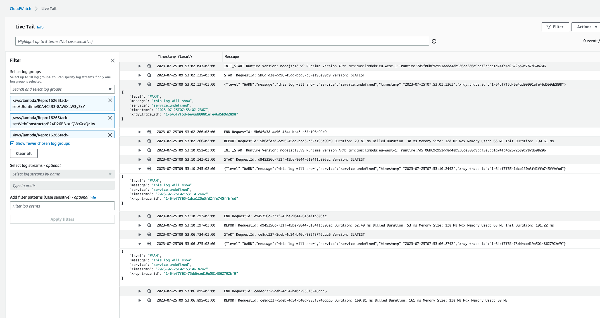

# Repro for Powertools for AWS issue #1626

## Run the sample

Clone the repo and run `npm ci` to install the dependencies.

Then run `npx cdk deploy` to deploy the stack.

Finally invoke the three functions and check the logs.

## Useful commands

* `npm run build`   compile typescript to js
* `npm run watch`   watch for changes and compile
* `npm run test`    perform the jest unit tests
* `cdk deploy`      deploy this stack to your default AWS account/region
* `cdk diff`        compare deployed stack with current state
* `cdk synth`       emits the synthesized CloudFormation template
